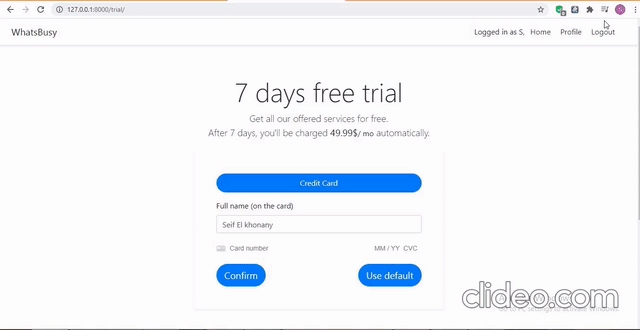
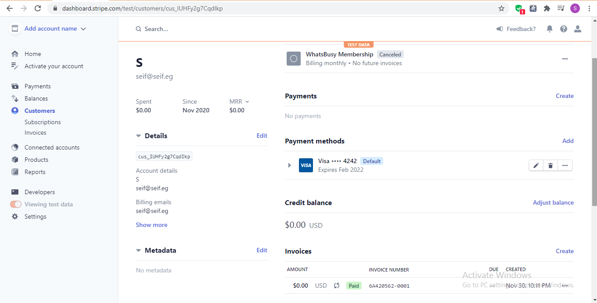

# django-registration-stripe
This was a trial project for my application to the company __Whatsbusy__.

## Demo

## About
This is a simple Django website where a user can sign up for the website using `django-registration`, 
create a membership with a trial period, add and remove several credit cards on their profile, 
all using the [Stripe APIs](https://stripe.com/docs/api).

## How to use
1. Clone the repository.

2. Install the requirements.

        pip install requirements.txt
    
3. Sign up for [Stripe](https://stripe.com/) as a developer and get your API keys from the Dashboard.

4. Create a Postgres database because the subscription model uses an __ArrayField__. Learn how to quickly set up one [here](https://dev.to/prisma/how-to-setup-a-free-postgresql-database-on-heroku-1dc1).

5. Create and set these environment variables for database credentials: `DB_USER`, `DB_NAME` and `DB_PASS`, in addition to `DJANGO_SECRET_KEY`.
        
6. Run `create_product.py` to create a product and a price in __Stripe__.

7. Create and set the environment variable `STRIPE_PRICE` to the value printed from the previous script.

8. Navigate to the root project directory in the terminal and migrate.

        python manage.py migrate

9. Run the local server.

        python manage.py runserver
        
10. Test the website using __Stripe__'s [testing](https://stripe.com/docs/testing) cards.

## Deployment
In order to go live with __Stripe__, you need to verify your company and get live API keys which is not available in some countries including mine.
This project is setup to be deployed with Heroku. You can complete the steps using this [tutorial](https://developer.mozilla.org/en-US/docs/Learn/Server-side/Django/Deployment).
